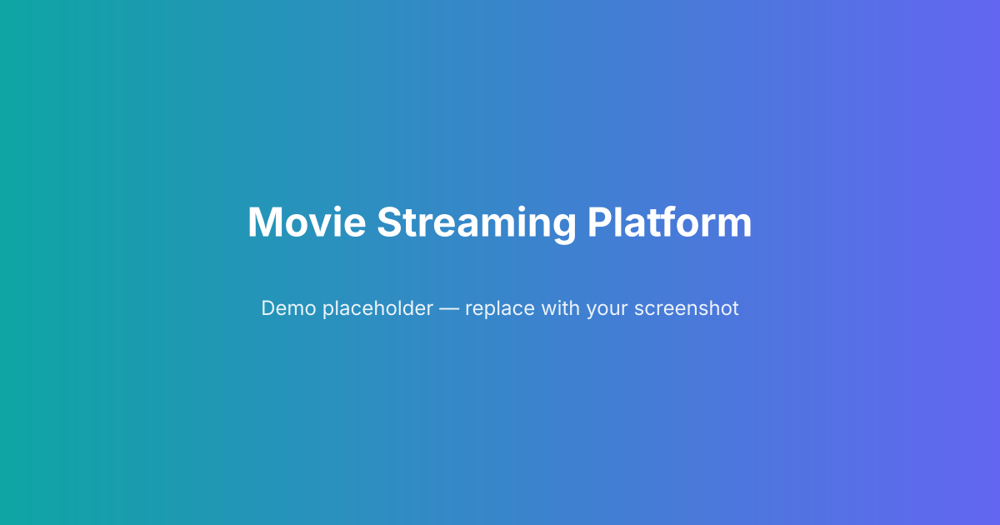

# Movie Streaming Platform

Ek simple movie streaming UI built with Vite + React.



Live Demo: https://example.com/live-demo  <!-- Replace this URL with your actual live site -->

## Overview

This repository contains a small React app showcasing a movie-streaming style UI with components for navigation, recent items, favorites, and a view-all page.

## Features

- Responsive UI (Vite + React)
- Components: `Navbar`, `Leftbar`, `Home`, `Recent`, `Favorite`, `Viewall`
- Simple styling with CSS

## Tech Stack

- React
- Vite
- JavaScript
- CSS

## Installation

1. Install dependencies:

```bash
npm install
```

2. Run development server:

```bash
npm run dev
```

3. Build for production:

```bash
npm run build
```

4. Preview production build:

```bash
npm run preview
```

## Project Structure

- `index.html`
- `src/`
	- `main.jsx` - app entry
	- `App.jsx` - main app
	- `components/` - UI components (Navbar, Leftbar, Home, Recent, Favorite, Viewall)

## Replace Demo Image and Live Link

- Demo image: replace `public/demo.svg` with a screenshot or image you want to show. The markdown image reference in this README points to `public/demo.svg`.
- Live demo: replace the `https://example.com/live-demo` placeholder above with your deployed URL.

## Notes

- This README uses placeholders for the demo image and live link as requested. Change them to real assets when ready.

---

If you want, I can add a sample `public/demo.png` placeholder image file now. Do you want me to add one?
